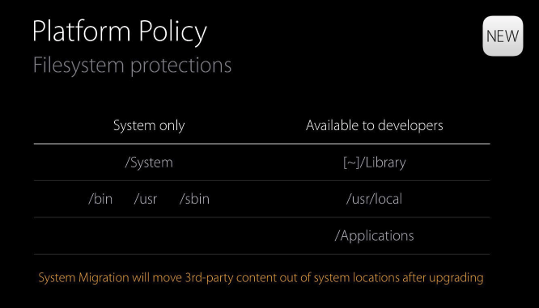
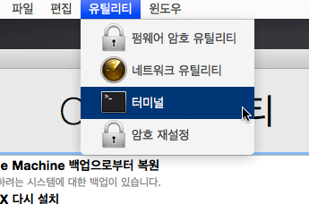

### Rootless?
* macOS System Integrity Protection (SIP)
* OS X 10.11 El Capitan 부터 도입된 새로운 보안기능
* 사용자나 응용 프로그램이 시스템 영역의 파일을 삭제하거나 변조할 수 없도록 '커널 레벨'에서 파일을 잠그는 기능
* 사용자가 관리자 권한을 가지고 있더라도 시스템 파일을 마음대로 건드릴 수 없도록 차단하는 기능을 담당


<figcaption>Rootless가 보호하는 영역</figcaption>

Rootless가 enable 일 때 위 영영에 ls, mv, cp 등의 작업을 시도한다면, 관리자 암호를 입력 하더라도 `Operation not permitted`라는 경고문을 띄우며 작업을 거부합니다. 이처럼 Root 계정으로도 시스템 파일에 접근할 수 없어서 `Root’less’`라고 이름을 지었나 봅니다.

시스템으로 유입된 악성코드가 중요한 파일을 위∙변조 하는 것을 원천적으로 방지해 주는 매우 효과적인 방어체제이지만, 시스템을 자신의 입맛에 맞게 바꿔서 사용하거나 패러렐즈나 VMWare 같이 운영체제와 아주 밀접하게 연동되는 소프트웨어의 기능을 제한하는 일종의 폐단으로 작용할 수 있습니다. 또 /usr 폴더에 설치되는 홈브류(Homebrew)나 맥포트(MacPort) 같은 패키지 관리 프로그램을 쓰는 분들에게도 큰 골칫거리입니다. 또 그동안 백투더맥을 통해 소개해 드린 여러 터미널 명령어도 새 OS X에서는 작동하지 않을 가능성이 매우 높습니다.
일반 사용자에게는 든든한 파수꾼이 생긴 셈이며 고급 사용자나 개발자에게는 방해꾼이 나타난 셈이라 새 보안 기능이 좋다 나쁘다 한쪽으로 단정지을 수는 없습니다. 아무튼 앞서 전해드린 사파리 확장 프로그램 [소식](http://macnews.tistory.com/3407) 과 마찬가지로 애플은 소프트웨어의 기능성이나 개발자들의 자율성보다는 운영체제의 보안성을 강화하는 쪽으로 방향을 잡고 있는 듯합니다.

### Rootless 비활성화/활성화 방법
1. 맥 종료 후 재시작
2. 재시작 되는 과정에서 ⌘Command+R 버튼을 눌러 복구모드로 진입
3. 복구 모드의 메뉴막대에서 `유틸리티 > 터미널` 실행

3. 터미널에 다음을 입력하여 SIP 기능을 비활성화 시킨 후 reboot
```
csrutil disable
reboot
```
4. 나중에 다시 SIP 기능을 활성화 하려면 다음을 입력
```
csrutil enable
```
5. 상태 확인
```
csrutil status
```

### Rootless 비활성화 상태에서 제어
비활성화 방식과는 달리 Rootless가 비활성 상태라면 정상 부팅 환경에서도 활성화 가능

1. 터미널 실행 후 다음 입력
```
$ sudo /usr/bin/csrutil clear
Successfully cleared System Integrity Protection. Please restart the machine for the changes to take effect.
```
2. 입력 후 재시동 하면 SIP 기능이 활성화


